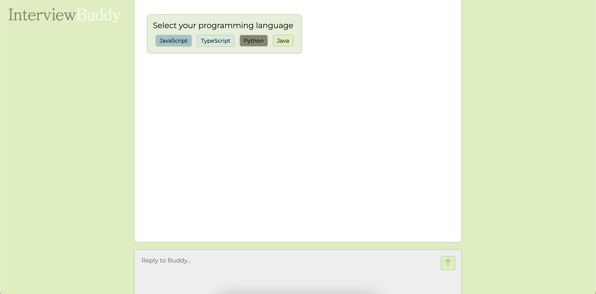

# Interview-Buddy

Interview Buddy is a AI Chatbot that helps software engineers prepare for technical interviews using the OpenAI gpt-3.5-turbo model. Users can select their preferred programming language, difficulty level, and focus on either data structures or algorithms to generate relevant practice questions. They can also enter their answers and receive feedback to enhance their preparation.

## Tech Stack

[](https://skillicons.dev)

- OpenAI gpt-3.5-turbo model

## Table of Contents

- [Introduction](#Interview-Buddy)
- [Installation](#Setup-Instructions)
- [User Guide](#User-Guide)
- [Contributing](#Contributing)
- [License](#license)
- [Our Team](#Interview-Buddy-Team)

## User Guide



### Setup Instructions

1. Clone the repository:
   ```bash
   git clone https://github.com/fcny-reinforcement-team/interview-buddy.git
   cd interview-buddy
   ```

---

2. Install dependencies:

```bash
 npm install
```

3. Start client and server

```bash
 npm start dev
```

## Contributing

We welcome contributions! To get started, please follow these steps:

1. **Fork the repository** and create a new branch:

```bash
   git checkout -b feature-name
```

2. Make your changes and ensure your code follows the project's style guidelines.
3. Commit your changes with a clear message:

```bash
git commit -m "Add feature-name: brief description"
```

4. Push to your fork and submit a Pull Request:

```bash
git push origin feature-name
```

Wait for review and address any feedback.

## Interview Buddy Team

- Tiara Dillard | [Github](http://github.com/yosoytiara/)
- Daisha Davis | [Github](https://github.com/daishadavis)
- Cindy Rodriguez-Llivipuma | [Github](https://github.com/csrl23)
- Mike Thurstlic | [Github](https://github.com/thurstlic7)
- Bryan Duncan | [Github](https://github.com/Bduncan87)
